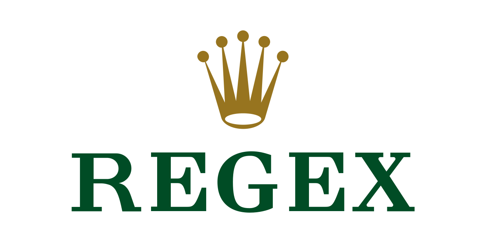

# Regex

> 🔔 Subscribe to the [newsletter](https://chv.to/chevere-newsletter) to don't miss any update regarding Chevere.


[](https://github.com/chevere/regex/actions)

[](LICENSE)
[](https://phpstan.org/)
[](https://dashboard.stryker-mutator.io/reports/github.com/chevere/regex/1.0)

[](https://sonarcloud.io/dashboard?id=chevere_regex)
[](https://sonarcloud.io/dashboard?id=chevere_regex)
[](https://sonarcloud.io/dashboard?id=chevere_regex)
[](https://sonarcloud.io/dashboard?id=chevere_regex)
[](https://sonarcloud.io/dashboard?id=chevere_regex)
[](https://sonarcloud.io/dashboard?id=chevere_regex)
[](https://www.codefactor.io/repository/github/chevere/regex)



Regex enables to create and handle a validated [regular expression](https://en.wikipedia.org/wiki/Regular_expression).

## Installing

Regex is available through [Packagist](https://packagist.org/packages/chevere/regex) and the repository source is at [chevere/regex](https://github.com/chevere/regex).

```sh
composer require chevere/regex
```

## Creating Regex

Create a Regex by passing the regular expression pattern.

```php
use Chevere\Regex\Regex;

$regex = new Regex('/^Hello World!$/');
```

## Reading pattern

### As-is

The `__toString` method is used to access the pattern passed on instance creation.

```php
$string = $regex->__toString();
// /^Hello World!$/
```

### Without delimiters

The `noDelimiters` method is used to access to the regex pattern without delimiters.

```php
$string = $regex->noDelimiters();
// ^Hello World!$
```

### Without delimiters and anchors

The `noDelimitersNoAnchors` method is used to access to the regex pattern without delimiters and anchors.

```php
$string = $regex->noDelimitersNoAnchors();
// Hello World!
```

## Match

The `match` method provides [preg_match](https://www.php.net/preg-match).

```php
$array = $regex->match('Hello World!');
// [Hello World!]
```

## Match All

The `matchAll` method provides [preg_match_all](https://www.php.net/preg-match-all).

```php
$regex->matchAll();
// [Hello World!]
```

## Assert Match

The `assertMatch` method asserts that the string matches. It throws `Exceptions\NoMatchException` when failing to assert.

```php
$regex->assertMatch('Hello World!');
```

## Assert Match All

The `assertMatchAll` method asserts that the string matches all. It throws `Exceptions\NoMatchException` when failing to assert.

```php
$regex->assertMatchAll('Hello World!');
```

## Documentation

Documentation is available at [chevere.org](https://chevere.org/packages/regex).

## License

Copyright 2024 [Rodolfo Berrios A.](https://rodolfoberrios.com/)

Chevere is licensed under the Apache License, Version 2.0. See [LICENSE](LICENSE) for the full license text.

Unless required by applicable law or agreed to in writing, software distributed under the License is distributed on an "AS IS" BASIS, WITHOUT WARRANTIES OR CONDITIONS OF ANY KIND, either express or implied. See the License for the specific language governing permissions and limitations under the License.
